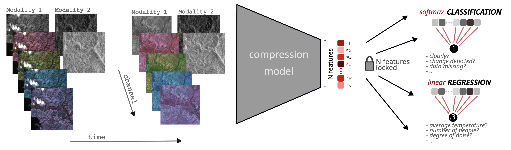

# NeuCo-Bench

**Licence**: Apache-2.0


NeuCo-Bench is an open-source, model-agnostic **benchmarking framework** for evaluating lossy neural compression algorithms through downstream task probing—prioritizing semantic fidelity over pixel-level metrics. 
Built for multi-modal, multi-temporal datasets such as Earth Observation (EO), it is released with an initial set of EO tasks. 

<p align="center">
  
</p>


## Key Features

- **Model-agnostic**: Accepts any fixed-size embedding (e.g., 1,024‑dimensional vectors) generated by your compression method.
- **Task-Driven Evaluation**: Uses linear probes (regression & classification) across heterogeneous EO tasks such as land-cover proportion, cloud detection, biomass estimation, and urban heat islands. 
- **Metrics**: Combines signal-to-noise utility scores with dynamic rank aggregation.

---

## Quickstart

```bash
git clone https://github.com/embed2scale/NeuCo-Bench.git && cd NeuCo-Bench
pip install -r requirements.txt

python evaluation.py \
  --annotation_path path/to/annotation_folder \
  --submission_file path/to/submission_file.csv \
  --output_dir path/to/results \
  --config path/to/config.yaml \
  --method_name your-method-name \
  --phase phase-name
```

- `--annotation_path` Directory with CSV label files for each task.  
- `--submission_file` CSV file containing your fixed-size embeddings.  
- `--output_dir` Destination for per-task reports, plots, and aggregated benchmark results.  
- `--config` YAML file specifying cross-validation settings and logging options. See provided sample config.  
- `--method_name` Identifier for your method, used in filenames and leaderboard entries.  
- `--phase` A name that groups a set of evaluation runs for joint ranking. Results for each phase are stored in a separate subfolder under `output_dir`.  

## Overview

NeuCo-Bench shifts from pixel-level reconstruction to task-oriented semantic evaluation. It measures how well embeddings preserve information for EO tasks under practical size constraints.


**Framework Architecture**  
- Embedding Generation: Compress multi-modal EO datacubes into fixed-size vectors via any model.
- Linear Probing: K-fold training/evaluation of linear classifiers/regressors per task.
- Quality Scoring: Compute task-specific signal-to-noise scores (Q-score).
- Dynamic Ranking: Weight tasks by Q-score variance across methods and aggregate ranks.


**Data and Downstream Tasks**

Link: [SSL4EO-S12-downstream on Hugging Face](https://huggingface.co/datasets/embed2scale/SSL4EO-S12-downstream)

The dataset consists of two folders:

- `data/`  
  Contains three modality subfolders—`s1/`, `s2l1c/`, and `s2l2a/`—each split into parts, with 1,000 `zarr.zip` files.

- `labels/`  
  Holds annotation files for each downstream task.

To run NeuCo-Bench on the SSL4EO-S12-downstream dataset, you need both `data/` and `labels/`.  
See the `examples/` to see how to load the data as a torch dataset.


**Creating Embeddings**

Use your preferred compression model to generate fixed-size vectors. 
Example scripts are provided in the `examples/` directory.


**Evaluation and Ranking**

After generating embeddings, evaluate with:

```bash
python evaluation.py \
  --annotation_path path/to/annotation_folder \
  --submission_file path/to/submission_file.csv \
  --output_dir path/to/results \
  --config path/to/config.yaml \
  --method_name "your-method-name" \
  --phase "phase-name"
```

Results appear under `output_dir/phase_name/` containing 
- Per-task metric insights and loss curves
- A `results_summary.json` with per-task and overall signal-to-noise scores


To aggregate and weight all runs in a phase, run the following:

```bash
from evaluation.results import summarize_runs
summarize_runs(output_dir=output_dir, phase=phase)
```


**Configuration**

A default setting can be seen in sample `config`. Adjustable parameters include:  

- `batch_size`, `epochs`, `learning_rate`, `k_folds`: Settings for Cross-Validation.  
- `standardize_embeddings`: Standardize embeddings using global mean and std.  
- `normalize_labels`: Normalize target labels to [0,1].  
- `enable_plots`: Generate per-fold plots (e.g., parity plots for regression).  
- `update_leaderboard`: Aggregate and update leaderboard after evaluation.  
- `task_filter`: List of task names to include (defaults to all in `annotation_path`). 

---

## Future Work & Contributing

All downstream tasks and labels are published on HuggingFace. We are planning to extend the framework to further tasks (eg. spatial and temporal downstream tasks).

We invite the community to collaborate and appreciate contributions, including but not limited to the following:
- Benchmark and contribute new compression techniques
- Incorporate additional downstream task and metrics
- Extension to further input modalities

Check out [CONTRIBUTING.md](.github/CONTRIBUTING.md).
