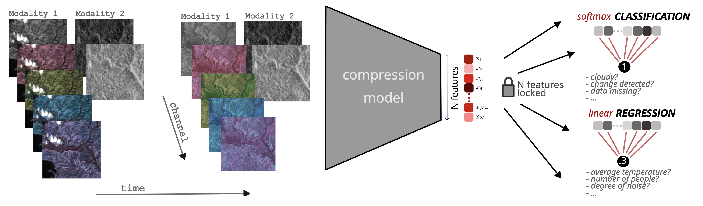

# NeuCo-Bench  

[](https://embed2scale.github.io/NeuCo-Bench/)  
[](LICENSE)

**TL;DR**: *Originally developed to evaluate challenge submissions for the 2025 EARTHVISION Challenge at CVPR ([competition details](https://www.grss-ieee.org/events/earthvision-2025/?tab=challenge)), NeuCo-Bench is now released for local benchmarking and evaluation - additional tech details in [http://arxiv.org/html/2510.17914](http://arxiv.org/html/2510.17914).*

---

NeuCo-Bench is a **benchmarking framework** designed to evaluate how effectively **compact, fixed-size embeddings** preserve information for downstream tasks.

In domains like Earth Observation (EO), pipelines typically handle large volumes of multi-modal, multi-temporal image data used primarily for analytical tasks. Yet, there is no standardized, method-agnostic benchmark that evaluates fixed-size embeddings, bridging both neural compression and representation learning. NeuCo-Bench addresses this gap by evaluating embeddings directly on real-world EO tasks under explicit embedding size constraints.

NeuCo-Bench provides an initial set of EO tasks and invites community contributions of additional tasks and datasets from EO and other domains.

<p align="center">
  
</p>


## Key Features

- **Model-agnostic**: Supports evaluation of any fixed-size embedding (e.g. 1024‑dim feature vectors), which enables comparison among compression and representation learning methods.
- **Task-Driven Evaluation**: Utilizes linear probes across diverse EO tasks, including land-cover proportion estimation, cloud detection, and biomass estimation. 
- **Metrics**: Incorporates signal-to-noise scores and dynamic rank aggregation to compare methods.

---

## Quickstart

```bash
# start from fresh environment (skip if not needed)
micromamba create -n neuco-bench -c conda-forge python=3.12
micromamba activate neuco-bench

# clone NeuCo-Bench and install requirements
git clone https://github.com/embed2scale/NeuCo-Bench.git
cd NeuCo-Bench/benchmark
pip install -r ../requirements.txt

# run standalone NeuCo-Bench evaluation script
python main.py \
  --annotation_path path/to/annotation_folder \
  --submission_file path/to/submission_file.csv \
  --output_dir path/to/results \
  --config path/to/config.yaml \
  --method_name your-method-name \
  --phase phase-name
```

- `--annotation_path` Directory containing CSV label files for each task.  
- `--submission_file` CSV file with your embeddings.  
- `--output_dir` Destination for per-task reports, plots, and aggregated benchmark results.  
- `--config` YAML file specifying cross-validation settings and logging options (see provided sample).  
- `--method_name` Identifier for your method used in filenames and leaderboard entries.  
- `--phase` Groups evaluation runs under a specified phase name for ranking, creating a subfolder within `output_dir`. 

To disable GPU utilization, run `CUDA_VISIBLE_DEVICES=''` before execution.

---

## Overview

To evaluate embeddings:
1. Download the [SSL4EO-S12-downstream dataset](https://huggingface.co/datasets/embed2scale/SSL4EO-S12-downstream) from Hugging Face (see [Data](#1-data)).  
2. Encode images into fixed-size embeddings, save as CSV (see [Embedding Generation](#2-embedding-generation)).  
3. Run NeuCo-Bench locally to evaluate and aggregate scores, generating a leaderboard (see [Evaluation and Ranking](#3-evaluation-and-ranking)).

---

### 1. Data

The **SSL4EO-S12-downstream** dataset provides a set of available benchmark tasks (Image Data + Labels) for working with NeuCo-Bench. The data format aligns with [SSL4EOS12 v1.1](https://github.com/DLR-MF-DAS/SSL4EO-S12-v1.1) and a reference PyTorch Dataset loader is available in `generate_embeddings/data`. 

For more details on the dataset structure and how to add custom tasks, see the [Data docs](https://embed2scale.github.io/NeuCo-Bench/data).

---

### 2. Embedding Generation

Generate embeddings for SSL4EO-S12-downstream or your custom data and save them as CSV files. We provide example scripts in `generate_embeddings/` that illustrate the required format and include two baselines. You can also use [TerraTorch](https://github.com/terrastackai/terratorch/tree/main/examples/embeddings) to export embeddings in the required `neuco_csv` format.

For size-constrained benchmarking, all methods should use the same embedding dimension limit (e.g. 1024 during the CVPR 2025 EarthVision challenge). 
A selection of reference CSV files from the challenge is available in the repository’s top-level `data/` directory (see `data/README.md`). The `data/` folder is tracked by Git LFS to keep initial clones of this repo slim. If you like to download the approx. 500 MB of embeddings, utilize:
```Bash
git lfs install
git pull
```

For details on the embedding csv format, standardization, label normalization, and validation, see the [Embedding Generation docs](https://embed2scale.github.io/NeuCo-Bench/embedding_generation).

---

### 3. Evaluation and Ranking

Run the benchmark on your embeddings with:

```bash
python main.py \
  --annotation_path path/to/annotation_folder \
  --submission_file path/to/submission_file.csv \
  --output_dir path/to/results \
  --config path/to/config.yaml \
  --method_name "your-method-name" \
```

See the full guide in the [Evaluation docs](https://embed2scale.github.io/NeuCo-Bench/evaluation_and_results).

**Configuration File**

Key options (see `configs/sample_config.yaml`):
- `batch_size`, `epochs`, `learning_rate`, `k_folds`: Cross-validation + training settings
- `embedding_dim`: optional size limit (smaller embeddings are padded)
- `standardize_embeddings`: standardize embeddings (recommended)
- `normalize_labels`: normalize labels to `[0,1]` (recommended)
- `enable_plots`: save loss curves + diagnostic plots
- `task_filter`: evaluate selected tasks only
- `update_leaderboard`: aggregate and rank runs

**Results**

Results are stored under:
```
output_dir/<phase>/<method>_<timestamp>/
```
Including:
- per‑task metrics + optional plots
- per‑task JSON files (`mean_score`, `std_dev`, `q_stat`)
- run‑level summary (`run_summary.json`)

**Leaderboard Aggregation**

Manually aggregate results with:

```python
from evaluation.results import summarize_runs
summarize_runs(output_dir=output_dir, phase=phase)
```

---

## Future Work & Contributing

All downstream tasks and labels are published on Hugging Face, and the framework is designed to be extended with additional tasks and evaluation setups.

We invite the community to collaborate and appreciate contributions, including but not limited to:
- Introduction of new downstream tasks and data
- Introduction of new evaluation methods
- Running data challenges
- Documentation updates, bug fixes, and general code improvements

For details on how to contribute, please see [CONTRIBUTING.md](.github/CONTRIBUTING.md).

---

## How to cite

```BibTeX
@article{Vinge2025NeuCoBench,
  author       = {Rikard Vinge and Isabelle Wittmann and Jannik Schneider and Michael Marszalek and Luis Gilch and Thomas Brunschwiler and Conrad M Albrecht},
  title        = {NeuCo-Bench: A Novel Benchmark Framework for Neural Embeddings in Earth Observation},
  journal      = {arXiv preprint arXiv:2510.17914},
  year         = {2025},
  url          = {https://arxiv.org/abs/2510.17914},
  doi          = {10.48550/arXiv.2510.17914},
  note         = {Submitted on 19 Oct 2025},
}
```
